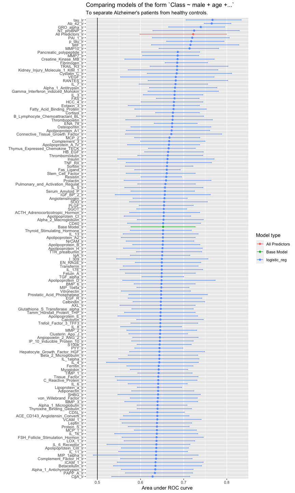
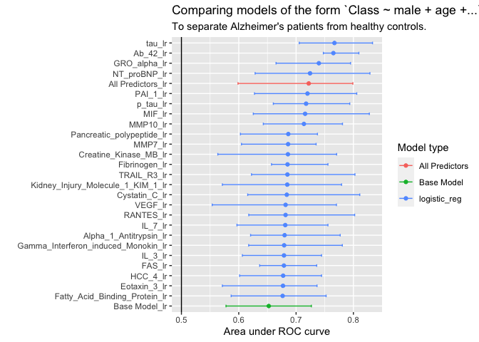
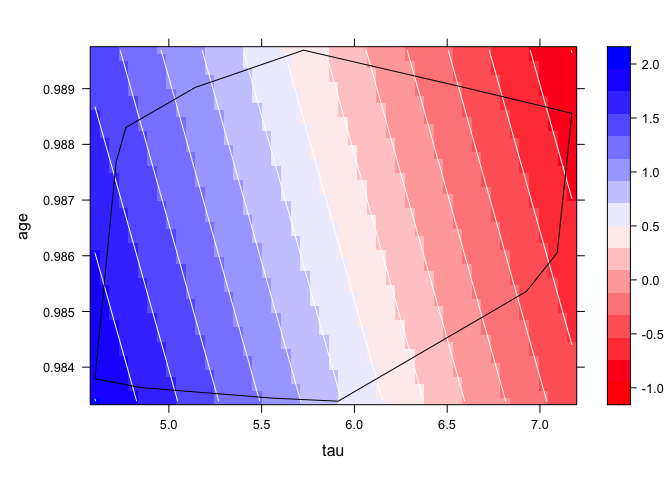
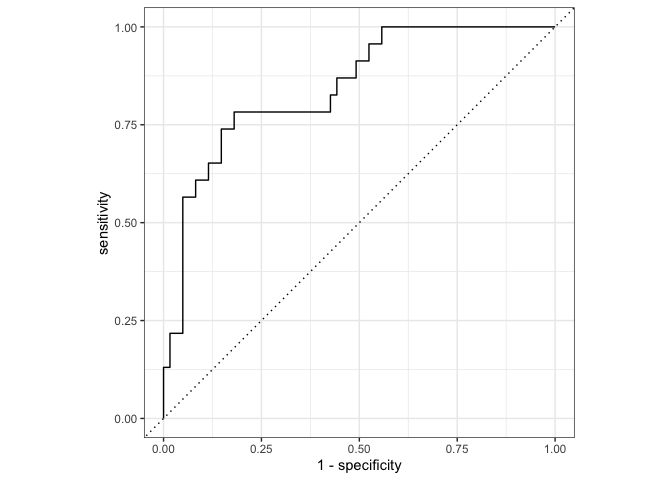
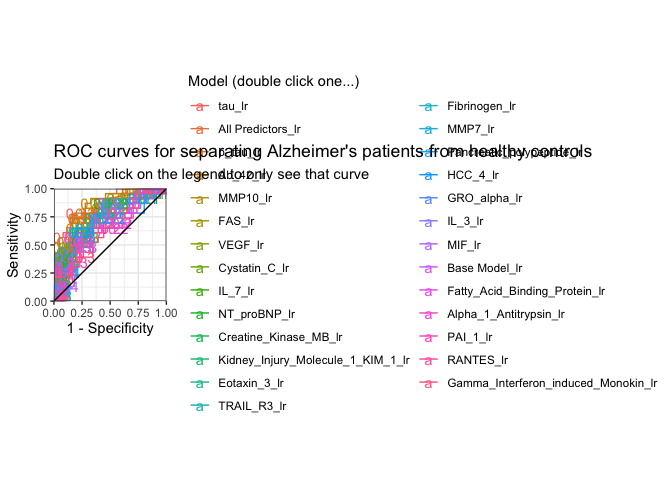
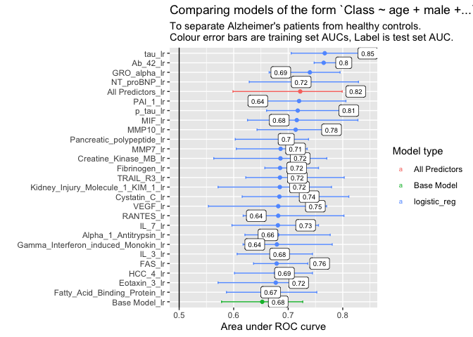

Tidymodels workflowsets classification example
================
Dr. Gordon McDonald

## Load

### Load libraries

``` r
library(tidymodels)
library(tidyverse)
library(DescTools) # for some combinatorics functions.
library(doParallel) #make the training run much faster
library(tictoc) #timing things
library(pdp) #partial dependence plots
```

### Load data

``` r
data(ad_data) # Alzheimer's disease data
dataset <- ad_data  # Replace with read_csv() or fread()

outcome_var <- "Class"

tbl <- table(dataset[[outcome_var]]) #class to predict is "Class"

positive_class <- names(tbl)[1]

dataset %>% sapply(class) %>% table # types of variables
```

    .
     factor integer numeric 
          2       2     127 

### Split data into test+train and make folds

``` r
set.seed(1)

trn_tst_split <- 
  initial_split(dataset %>% 
                  select(outcome_var,where(is.numeric)), 
                strata = outcome_var) # Stratify on outcome
```

    Note: Using an external vector in selections is ambiguous.
    ℹ Use `all_of(outcome_var)` instead of `outcome_var` to silence this message.
    ℹ See <https://tidyselect.r-lib.org/reference/faq-external-vector.html>.
    This message is displayed once per session.

``` r
dataset_train <- training(trn_tst_split)
dataset_test  <- testing(trn_tst_split)

folds <- 
  vfold_cv(dataset_train, 
           strata = outcome_var) # Stratify on outcome
```

``` r
# WT <- map(dataset_train %>% select(where(is.numeric)),
#           ~wilcox.test(.x[which(dataset_train$Class == "Impaired")], 
#                        .x[which(dataset_train$Class == "Control")])$p.value) %>% unlist %>% sort()
```

### Choose model engines

``` r
# Linear regression
lr_spec <- 
  logistic_reg() %>% 
  set_engine("glm")

# Random forest
rf_spec <- 
  rand_forest(mtry = tune(), 
              min_n = tune(), 
              trees = 1000) %>% 
  set_engine("ranger") %>% 
  set_mode("classification")
```

### Specify model formulae you want to fit

``` r
## Simple formulas
# formulas <- 
#   list("Class ~ tau + Ab_42",
#        "Class ~ 1",
#        "Class ~ .") %>% 
#   lapply(as.formula)


# 1 level of variable selection using custom function

# function to generate all possible combinations of formulas with n variables added to a base formula
source(here::here("add_n_var_formulas.R"))

#models with gender + 1 variable
formulas <- add_n_var_formulas(
  y_var = outcome_var,
  x_vars = c(
    # start with gender and age
    "male",
    "age"),
  data = dataset_train,
  n=1)
```

    Warning: The `x` argument of `as_tibble.matrix()` must have unique column names if `.name_repair` is omitted as of tibble 2.0.0.
    Using compatibility `.name_repair`.
    This warning is displayed once every 8 hours.
    Call `lifecycle::last_lifecycle_warnings()` to see where this warning was generated.

### Create a recipe from each formula

``` r
recipes <-
  map(formulas, function(form) {
    recipe(form, 
           data = dataset_train) %>%
      step_impute_median(all_predictors())
    #step_naomit(all_predictors(),skip = TRUE)
  })
# step_impute_median() plays nice with ranger rf models, step_naomit() does not.
```

### Create our workflow set:

``` r
model_workflows <-
  workflow_set(
    preproc = recipes,
    models = list(#rf = rf_spec, #uncomment to make rf go as well
                  lr = lr_spec)
  )
```

### Create the hyperparameter training grid:

``` r
grid_ctrl <-
  control_grid(
    save_pred = TRUE,
    parallel_over = "everything",
    save_workflow = TRUE
  )
```

### Set-up for parallel processing and fit models

``` r
model_file <- "./saved_models/test_one_term_models.Rds"

if (file.exists(model_file)){
  model_workflows <- readRDS(file = model_file)
} else {
  
  # Train all the models 
  #- takes 3min for one variable, 129 models on 12 cores.
  
  all_cores <- parallel::detectCores(logical = TRUE)
  cl <- makePSOCKcluster(all_cores)
  registerDoParallel(cl)
  
  tic(msg = "model training time")
  
  model_workflows <-
    model_workflows %>%
    workflow_map("tune_grid",
                 seed = 1503,
                 grid = 25,
                 control = grid_ctrl,
                 resamples = folds,
                 verbose = TRUE)
  
  toc()
  
  
  saveRDS(model_workflows, file = model_file)
  
  stopImplicitCluster()
}
```

### Then look at results:

``` r
roc_values <- 
  model_workflows %>% 
  collect_metrics(summarize = FALSE) %>% 
  filter(.metric == "roc_auc")

summary_stats <- 
  roc_values %>% 
  group_by(wflow_id, model) %>% 
  dplyr::summarize(
    ROC = mean(.estimate),
    lower = quantile(.estimate,probs = 0.2),
    upper = quantile(.estimate,probs = 0.8),
    .groups = "drop"
  ) %>% 
  mutate(
    model = if_else(grepl("All Predictors",wflow_id),"All Predictors",model),
    model = if_else(grepl("Base Model",wflow_id),"Base Model",model),
    wflow_id = factor(wflow_id),
    wflow_id = reorder(wflow_id, ROC)
  )

# Plot the summary
summary_stats %>% 
  ggplot(aes(x = ROC, y = wflow_id, color = model)) + 
  labs(color = "Model type", 
       title = "Comparing models of the form `Class ~ male + age +...`", 
       subtitle = "To separate Alzheimer's patients from healthy controls.",
       x = "Area under ROC curve",
       y =  "Additional Variable")+
  geom_point() + 
  geom_vline(xintercept = .5)+#line of predicting no better than chance
  geom_errorbar(aes(xmin = lower, xmax = upper), width = .25) +
  ylab("")
```



## A small subset for easier analysis:

``` r
model_subset <-
  summary_stats %>% 
  filter(model == "All Predictors" |
           model == "Base Model" |
           ROC>=quantile(ROC, 0.8) )

model_subset %>% 
  ggplot(aes(x = ROC, y = wflow_id, color = model)) + 
  labs(color = "Model type", 
       title = "Comparing models of the form `Class ~ male + age +...`", 
       subtitle = "To separate Alzheimer's patients from healthy controls.",
       x = "Area under ROC curve",
       y =  "Additional Variable")+
  geom_point() + 
  geom_errorbar(aes(xmin = lower, xmax = upper), width = .25) +
  geom_vline(xintercept = .5)+
  ylab("")
```



It looks like a logistic regression of the form
`Class ~ male + age + tau` is better than the kitchen sink model with
all predictors.

## First, fit it to the test data

``` r
fit_model_test<-function(workflowset, 
                         wfl_id = "tau_lr", 
                         mtr = "roc_auc",
                         splt = trn_tst_split){
  print(wfl_id)
  best_results <- 
    workflowset %>% 
    extract_workflow_set_result(wfl_id) %>% 
    select_best(metric = mtr)
  
  best_test_results <- 
    workflowset %>% 
    extract_workflow(wfl_id) %>% 
    finalize_workflow(best_results) %>% 
    last_fit(split = splt) %>% 
    mutate("wflow_id" = wfl_id)
  
  class(best_test_results) <- c("last_fit", class(best_test_results))
  
  best_test_results
  
}

best_test_results <- 
  fit_model_test(model_workflows, 
                 wfl_id = "tau_lr",
                 mtr = "roc_auc",
                 splt = trn_tst_split)
```

    [1] "tau_lr"

    Warning: package 'rlang' was built under R version 4.0.5

    Warning: package 'vctrs' was built under R version 4.0.5

## Extract the fitted model:

``` r
winning_glm <- best_test_results %>% extract_fit_engine() # gets resulting glm

summary(winning_glm)
```


    Call:
    stats::glm(formula = ..y ~ ., family = stats::binomial, data = data)

    Deviance Residuals: 
        Min       1Q   Median       3Q      Max  
    -2.4850  -0.7974   0.4556   0.7312   1.6590  

    Coefficients:
                 Estimate Std. Error z value Pr(>|z|)    
    (Intercept)  168.2070   123.1545   1.366    0.172    
    male          -0.5209     0.3247  -1.604    0.109    
    age         -158.0884   125.4406  -1.260    0.208    
    tau           -1.8760     0.3426  -5.475 4.37e-08 ***
    ---
    Signif. codes:  0 '***' 0.001 '**' 0.01 '*' 0.05 '.' 0.1 ' ' 1

    (Dispersion parameter for binomial family taken to be 1)

        Null deviance: 291.98  on 248  degrees of freedom
    Residual deviance: 239.80  on 245  degrees of freedom
    AIC: 247.8

    Number of Fisher Scoring iterations: 4

In this case age and gender don’t seem significant anymore but perhaps
they need to be included for other reasons, e.g. the researcher wants
them controlled for, or there is previous research which says they have
an effect.

## Look at dependence on tau and age:

``` r
winning_glm %>% 
  pdp::partial(pred.var = c("tau", 
                            "age"),
               train = dataset_train) %>% 
  pdp::plotPartial(contour = TRUE, 
                   col.regions = colorRampPalette(c("red", "white", "blue")), 
                   chull = TRUE,
                   train = dataset_train)
```



The black like is the convex hull of the training data, i.e. don’t trust
the model outside the black line as you are then extrapolating.

## Let’s look at the ROC curves of each of the top models with the test set

``` r
best_test_results$.predictions[[1]] %>% 
  {roc_curve(data = .,!!rlang::data_sym(paste0(".pred_",positive_class)),
             truth = !!rlang::data_sym(outcome_var))} %>%
  autoplot()
```



``` r
make_test_set_roc_df <- function(model_workflows, 
                                 split = trn_tst_split, 
                                 win_models = c("All Predictors_rf",
                                                "All Predictors_lr",
                                                "Base Model_rf",
                                                "Base Model_lr",
                                                "tau_lr"),
                                 mtr = "roc_auc") {
  
  winner_results <- 
    win_models %>% 
    map_dfr(~fit_model_test(
      workflowset = model_workflows,
      wfl_id = .x, 
      mtr = mtr,
      splt = split))
  
  a<-
    winner_results %>%
    dplyr::select(.predictions,wflow_id) %>%
    unnest(cols = .predictions) %>% 
    group_by(wflow_id) %>% 
    roc_curve(data = .,
              !!rlang::data_sym(paste0(".pred_",positive_class)),
              truth = !!rlang::data_sym(outcome_var)) %>% 
    ungroup
  
  b<-
    winner_results %>% 
    mutate(roc_a = map_dbl(.metrics,~.x$.estimate[.x$.metric==mtr])) %>% 
    dplyr::select(roc_a, wflow_id)
  
  roc_curves<-inner_join(a,b,by = "wflow_id")
  
  roc_curves %>%
    arrange(desc(roc_a),sensitivity,.threshold) %>% 
    mutate(wflow_id = as.factor(wflow_id),
           wflow_id = forcats::fct_inorder(f = wflow_id,ordered = T))
}


test_roc_curves <-
  model_workflows %>% 
  make_test_set_roc_df(split = trn_tst_split, 
                       win_models = model_subset$wflow_id %>% as.character(),
                       mtr = "roc_auc")
```

    [1] "Ab_42_lr"
    [1] "All Predictors_lr"

    ! train/test split: preprocessor 1/1, model 1/1: glm.fit: algorithm did not converge, glm.fi...

    [1] "Alpha_1_Antitrypsin_lr"
    [1] "Base Model_lr"
    [1] "Creatine_Kinase_MB_lr"
    [1] "Cystatin_C_lr"
    [1] "Eotaxin_3_lr"
    [1] "FAS_lr"
    [1] "Fatty_Acid_Binding_Protein_lr"
    [1] "Fibrinogen_lr"
    [1] "Gamma_Interferon_induced_Monokin_lr"
    [1] "GRO_alpha_lr"
    [1] "HCC_4_lr"
    [1] "IL_3_lr"
    [1] "IL_7_lr"
    [1] "Kidney_Injury_Molecule_1_KIM_1_lr"
    [1] "MIF_lr"
    [1] "MMP10_lr"
    [1] "MMP7_lr"
    [1] "NT_proBNP_lr"
    [1] "p_tau_lr"
    [1] "PAI_1_lr"
    [1] "Pancreatic_polypeptide_lr"
    [1] "RANTES_lr"
    [1] "tau_lr"
    [1] "TRAIL_R3_lr"
    [1] "VEGF_lr"

``` r
test_roc <- 
  test_roc_curves %>%
  dplyr::select(wflow_id, roc_a) %>% 
  unique()
p<-
test_roc_curves %>%   
  ggplot(.,aes(y = sensitivity, 
                x = 1-specificity, 
                color = wflow_id,
                label = round(.threshold,1)))+
      geom_line()+
      geom_text(data = . %>% 
                  mutate(rnd = round(.threshold,1)) %>% 
                  group_by(wflow_id, rnd) %>% 
                  filter(abs(rnd-.threshold)==min(abs(rnd-.threshold))))+
      labs(title = "ROC curves for separating Alzheimer's patients from healthy controls",
           subtitle = "Double click on the legend to only see that curve",
           color = "Model (double click one...)",
           y = "Sensitivity",
           x = "1 - Specificity")+
      coord_fixed(ratio = 1,expand = FALSE)+
      theme_bw()+
      geom_abline(slope = 1, intercept = 0)+
      scale_color_discrete()+
      theme(legend.position = "right")
p#%>% plotly::ggplotly()
```



``` r
#saveRDS(p,"saved_plot_objects/ROC.Rds")
#htmlwidgets::saveWidget(p %>% plotly::ggplotly(), "saved_widgets/ROC.html", selfcontained = F, libdir = "lib")
```

``` r
pAUC<-
summary_stats %>% 
  dplyr::filter(as.character(wflow_id) %in% model_subset$wflow_id)%>% 
  ggplot(aes(x = ROC, y = wflow_id, color = model)) + 
  labs(color = "Model type", 
       title = "Comparing models of the form `Class ~ age + male +...`", 
       subtitle = "To separate Alzheimer's patients from healthy controls. \nColour error bars are training set AUCs, Label is test set AUC.",
       x = "Area under ROC curve",
       y =  "Additional Variable")+
  geom_point() + 
  geom_vline(xintercept = .5)+
  geom_errorbar(aes(xmin = lower, xmax = upper), width = .25) +
  geom_point(data = test_roc, mapping = aes(x = roc_a, y = wflow_id, color = NULL), size = 3) + 
  geom_label(data = test_roc, mapping = aes(x = roc_a, y = wflow_id, label = round(roc_a,2), color = NULL), size = 2.5)+
  ylab("")
pAUC
```



``` r
#saveRDS(pAUC,"saved_plot_objects/AUCs.Rds")
#ggsave("saved_images/AUCs.pdf",width = 7,height = 3.5)
```

So it looks like `tau` wins, even in the test set.
